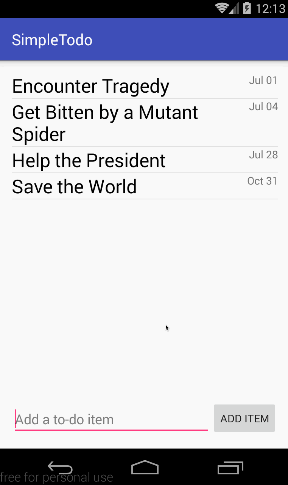

# SimpleTodo

This is an Android practice application: a To-Do List!

Time spent: 10 hours spent in total

Completed user stories:

 * [x] Required: add and remove items from the todo list from app
 * [x] Required: ability to edit todo items
 * [x] Required: persist todo items and retrieve them properly on app restart
 * [x] Required: push code to github
 * [x] Required: this README.md with gifs
 * [x] Required: create an issue on the repo and include relevant reviewers
 * [x] Optional: persist the todo items into SQLite instead of a text file
 * [x] Optional: improve style of the todo items in the list using a custom adapter
 * [x] Optional: add support for completion due dates for todo items (and display within listview item)
 
Notes:

Fun times.

Walkthrough of all user stories:

GIF created with [LiceCap](http://www.cockos.com/licecap/).
